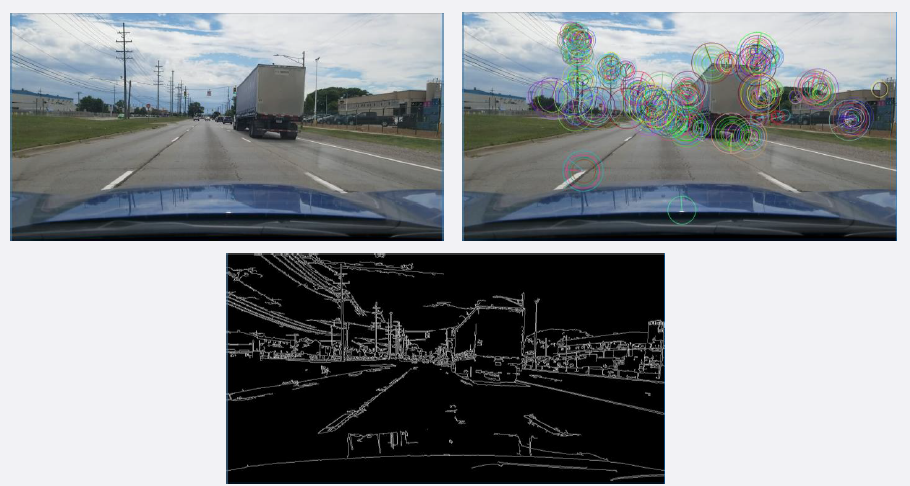
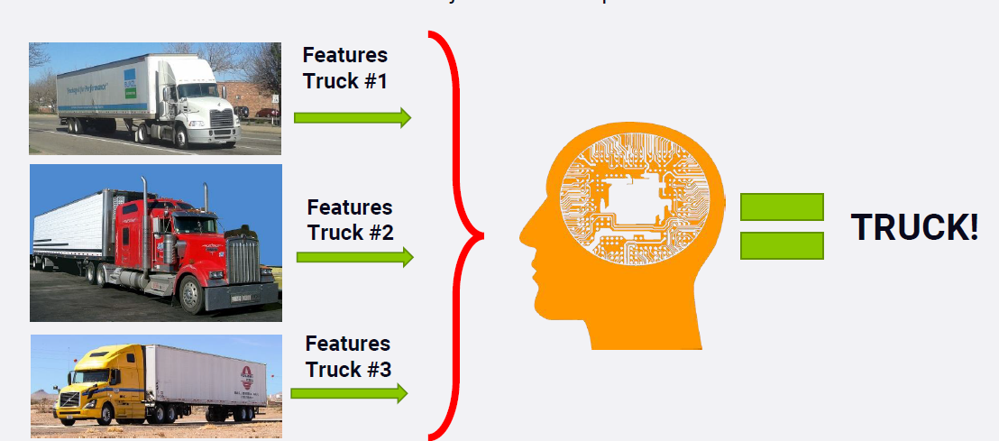
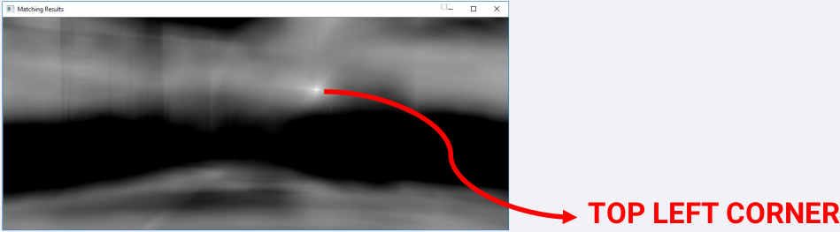
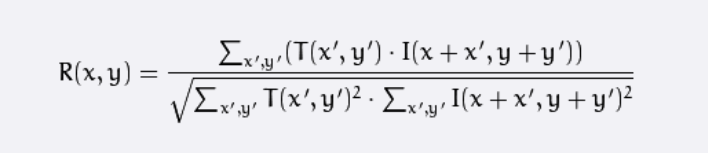
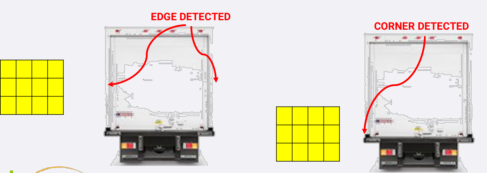
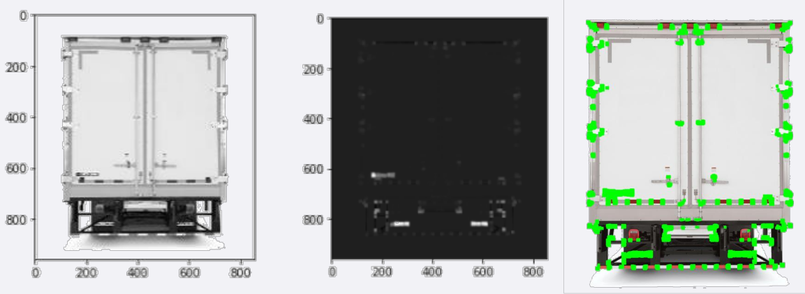

### IMAGE FEATURES

* Image Features are important areas an image that are unique to a specific image.
* A feature is a piece of information in the image such as points, edges or objects that is different/unique.
* A feature may be a color or a detected edge.
* A good feature has to be repeatable, i.e.: if feature can be detected in two or more different images of the same scene.

### FEATURE IMPORTANCE

* Image Features are critical in machine learning and self-driving cars because they can be used to analyze, describe and match images.
* Features can be used to train a classifier to detect objects such as pedestrians and cars.

### OBJECT (TRUCK) DETECTION
* Our goal is to find objects (truck) in this image using template matching.
* OpenCV has functions to perform this easily: **cv2.matchTemplate(), cv2.minMaxLoc()**

### TEMPLATE MACTHING

* **cv2.matchTemplate()** simply slides the template image over the input image (as in 2D convolution) and compares the
template and patch of input image under the template image.
* The function returns a grayscale image, where each pixel denotes how much does the neighbourhood of that pixel
match with template.
* If input image is of size (WxH) and template image is of size (wxh), output image will have a size of (W-w+1, H-h+1).
* Once you got the result, **cv2.minMaxLoc()** function is used to find where is the maximum/minimum value. Take it as
the top-left corner of rectangle and take (w,h) as width and height of the rectangle. That rectangle is the region of
template.

* **cv2.matchTemplate()** simply slides the template image over the input image using one of the methods:
**method=CV_TM_CCORR_NORMED**
* The function slides through image I, compare it to the template T and generate a result image R
* The summation is done over template and/or the image patch

* Template has to be in the same orientation as in the original image (No rotation is allowed).
* Image sizing and scale is a challenge.
* Driving conditions such as weather, brightness and contrast.
* Perspective will challenge the technique.

References:
* https://docs.opencv.org/3.0-beta/doc/py_tutorials/py_imgproc/py_template_matching/py_template_matching.html

### CORNERS AND EDGES AS FEATURES

* Edges are identified when change in intensity is noticed in one direction.
* Corners are identified when shifting a window in any direction over that point gives a large change in intensity in all
directions.

### CORNERS AND EDGES AS FEATURES

* Corners are regions in the image with large variation in intensity in all the directions.
* Harris corner detection finds the difference in intensity for a displacement of u, v in all directions.
* OpenCV has the function **cv2.cornerHarris(img, block size, ksize, k)**
    * img - Input image, it should be grayscale and float32 type.
    * blockSize - It is the size of neighbourhood considered for corner detection
    * ksize - Aperture parameter of Sobel derivative used.
    * k - Harris detector free parameter in the equation (set to 0.1).
    

### CORNER AND EDGE DETECTION LIMITATION

* Detecting corners as features in images can work well even of the image is:
    * Rotated, Translated and experienced changes in brightness
    * I.e.: even if the image is rotated, we can still find the same corners.
* The technique is challenged if the image is enlarged (scaling issues).
    * A corner may not be a corner if the image is scaled.
    * A corner in a small image would result in multiple corners in a zoomed-in larger image.
    
