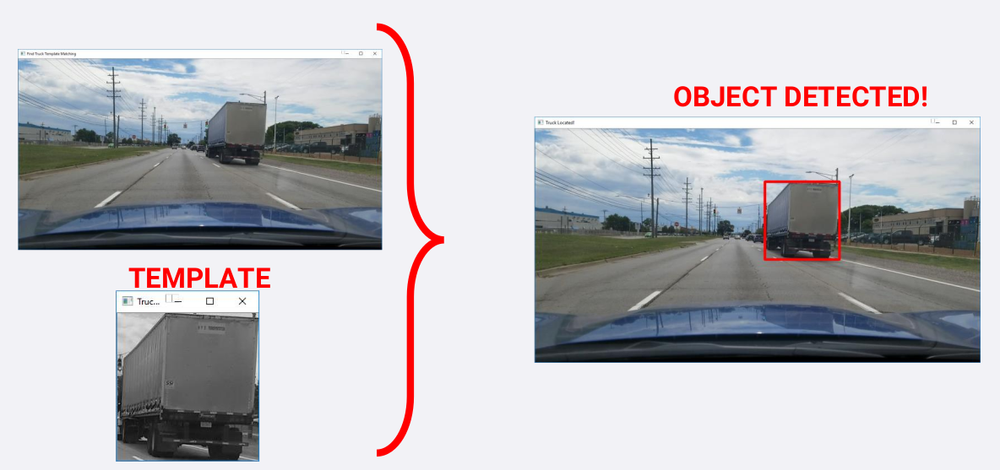
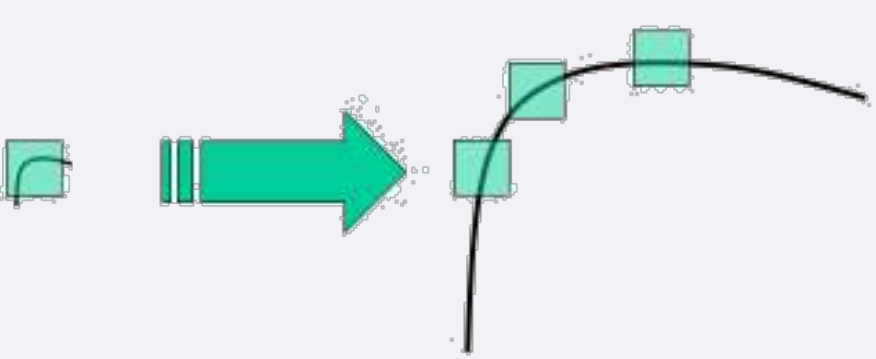

### IMAGE FEATURES

* Image Features are important areas an image that are unique to a specific image.
* A feature is a piece of information in the image such as points, edges or objects that is different/unique.
* A feature may be a color or a detected edge.
* A good feature has to be repeatable, i.e.: if feature can be detected in two or more different images of the same scene.

### FEATURE IMPORTANCE

* Image Features are critical in machine learning and self-driving cars because they can be used to analyze, describe and match images.
* Features can be used to train a classifier to detect objects such as pedestrians and cars.

### OBJECT (TRUCK) DETECTION
* Our goal is to find objects (truck) in this image using template matching.
* OpenCV has functions to perform this easily: **cv2.matchTemplate(), cv2.minMaxLoc()**

### TEMPLATE MACTHING

* **cv2.matchTemplate()** simply slides the template image over the input image (as in 2D convolution) and compares the
template and patch of input image under the template image.
* The function returns a grayscale image, where each pixel denotes how much does the neighbourhood of that pixel
match with template.
* If input image is of size (WxH) and template image is of size (wxh), output image will have a size of (W-w+1, H-h+1).
* Once you got the result, **cv2.minMaxLoc()** function is used to find where is the maximum/minimum value. Take it as
the top-left corner of rectangle and take (w,h) as width and height of the rectangle. That rectangle is the region of
template.

* **cv2.matchTemplate()** simply slides the template image over the input image using one of the methods:
**method=CV_TM_CCORR_NORMED**
* The function slides through image I, compare it to the template T and generate a result image R
* The summation is done over template and/or the image patch

* Template has to be in the same orientation as in the original image (No rotation is allowed).
* Image sizing and scale is a challenge.
* Driving conditions such as weather, brightness and contrast.
* Perspective will challenge the technique.

### CORNERS AND EDGES AS FEATURES

* Edges are identified when change in intensity is noticed in one direction.
* Corners are identified when shifting a window in any direction over that point gives a large change in intensity in all
directions.

### CORNERS AND EDGES AS FEATURES

* Corners are regions in the image with large variation in intensity in all the directions.
* Harris corner detection finds the difference in intensity for a displacement of u, v in all directions.
* OpenCV has the function **cv2.cornerHarris(img, block size, ksize, k)**
    * img - Input image, it should be grayscale and float32 type.
    * blockSize - It is the size of neighbourhood considered for corner detection
    * ksize - Aperture parameter of Sobel derivative used.
    * k - Harris detector free parameter in the equation (set to 0.1).
    

### Edge Detection a simple example:

### CORNER AND EDGE DETECTION LIMITATION

* Detecting corners as features in images can work well even of the image is:
    * Rotated, Translated and experienced changes in brightness
    * I.e.: even if the image is rotated, we can still find the same corners.
* The technique is challenged if the image is enlarged (scaling issues).
    * A corner may not be a corner if the image is scaled.
    * A corner in a small image would result in multiple corners in a zoomed-in larger image.
    

### IMAGE PYRAMIDING

* Image pyramiding refers to resizing the image by enlarging or shrinking.
* Pyramiding is important in object detection since it allows us to search for the object at various scales.
* An image pyramid is a collection of images - all arising from a single original image - that are successively down sampled until some
desired stopping point is reached.
* By doing so, a M×N image becomes M/2×N/2 image. So area reduces to one-fourth of original area.

### IMAGE DONWSIZING AND GAUSSIAN BLURRING

* Pyramiding is used for template matching by finding an object at different scales
* Gaussian pyramiding is one of the common types of image pyramiding and is used to down sample images
* Filtering the image, then subsample enhances the image quality (smoothness).
* Gaussian pyramids steps:
    (1)Convolve the image with a Gaussian kernel
    (2)Remove every even-numbered row and column
    

### HISTOGRAM OF COLORS

* We can use the color histogram for feature detection, OpenCV has a histogram function as follows:
**cv2.calcHist([image], [channels], mask, [histSize], [ranges])**
* images: source image
* channels: histogram index of channel, i.e.: [0], [1] or [2] for blue, green or red channel respectively.
* mask: put "None“ for the entire image.
* histSize : bin count, put [256] for full scale.
* ranges: put [0,256].

### HISTOGRAMS OF ORIENTED FEATURES

* For function **f(x, y)**, the gradient is the vector **(f x , f y )**.
* An image is a discrete function of (x, y) so image gradient can be calculated as well.
* At each pixel, image gradient horizontal **(x-direction)** and vertical **(y-direction)** are calculated.
f y
* These vectors have a direction *atan( f )* and a magnitude **( (f x2 + f y2 )
x**
* Gradient values are mapped to 0 - 255. Pixels with large negative change will be black, pixels with large positive change will be white,
and pixels with little or no change will be gray.

### GRADIENT REPRESENTATION OF A  PIXEL

* The gradient value in the X-direction is 120-70=50
* Y-direction is 100-50=50.
* Putting it together we will have [50 50] feature vector.
* The magnitude and direction are calculated as follows:

### CALCULATE PIXEL MAGNITUDE AND ANGLE

If we chouse an area of a inmage to sample then we need to figure out:
    * the change in the **x-direction**; change in the **y-direction**. From a mathematical standpoint this it the difference between the previous pixel value. Value can be normalized so we avoid negatice
    * get the magnitude
    * get the gradient angle which is the direction of the pixel(vector)

### GETTING THE HISTOGRAM

If we have an image then we can think of it as of a representation in **x,y direction**. Obviously we are interested in the changing of patterns from a given area to a given area.
In the picture below we defined area by a **(8\*8)** . As an end result would like to have the pixels represented by magnitude an direction.

### HOG REPRESENTATION OF A TRUCK

### IMAGE DECOMPOSED ON X;Y DIRECTION and HISTOGRAM OF colors

Step 1:
    * Using 8 x 8 pixel cell, compute gradient mag/direction
Step 2:
    * Create a histogram of generated 64 (8 x 8) gradient vectors
    * Each cell is then split into angular bins, each bin corresponds to a gradient direction (9 bins 0-180°) (20° each bin).
    * This reduces 64 vectors to just 9 values

### HOG FEATURE REPRESENTATION BY PERIMETER

### Mathematical notions

In mathematics, the gradient is a multi-variable generalization of the derivative. While a derivative can be defined on functions of a single variable, for functions of several variables, the gradient takes its place. The gradient is a vector-valued function, as opposed to a derivative, which is scalar-valued. 
So simply put the gradient is the multivariable representation on a derivate.

### Cartesian coordinates
In the three-dimensional Cartesian coordinate system with a Euclidean metric, the gradient, if it exists, is given by: 

A derivate represent actually the change in function **y=f(x)** determined by the change in x.
If we want to approximate the line on x;y space then we could do this by determining the change in the x-y position and this is the differece.
As the changes are infinitesimal we can't reproduce this and practically we must approxmiate the steps.
The slope represents the **(change in y)/(change in x)**

### Derivate mathe formula

### Geomatrical representation of the slope

### Tangent

References:

* https://docs.opencv.org/3.0-beta/doc/py_tutorials/py_imgproc/py_template_matching/py_template_matching.html
* https://www.docs.opencv.org/2.4/doc/tutorials/imgproc/histograms/template_matching/template_matching.html
* https://docs.opencv.org/3.0-beta/doc/py_tutorials/py_feature2d/py_features_harris/py_features_harris.html
* http://www.cse.psu.edu/~rtc12/CSE486/lecture06.pdf
* https://en.wikipedia.org/wiki/Harris_Corner_Detector
* http://graphics.cs.cmu.edu/courses/15-463/2005_fall/www/Lectures/Pyramids.pdf
* https://stackoverflow.com/questions/19815732/what-is-gradient-orientation-and-gradient-magnitude/19816362#19816362
* https://en.wikipedia.org/wiki/Gradient
* https://en.wikipedia.org/wiki/Derivative