### WHAT IS MACHINE LEARNING

Machine learning is an umbrella turn that encompasses:

    * machine learning
    * netural networks
    * AI
    * deep learning

Is uses algorithm to provide answers to a set of data. Based on a **model and features**, a result **labels** are given.
It splits that dataset into **training/testing** datasets, and based on the trained model the function tries to approximate the test dataset labels.
It evaluates the trained dataset based on the error in relation with the error given by testing dataset,
The scope of an algorithm is to converge to an model with the least possible error.

In relation with computer vision a machine learning can be traing to recognize street signs. Beforehand we give the algorithms **labeled data**, street signs and based on those it can recognize new street signs based on the video streams.

### WHAT IS CROSS VALIDATION

We want to evaluate our model performance. So we split the dataset into **training/testing** datasets and we want to evaluate how good a model is at predicting labels on the testing sets..
My might want to split the dataset into **80%** for training and **20%** for testing. The using an error metric we computer the performance.

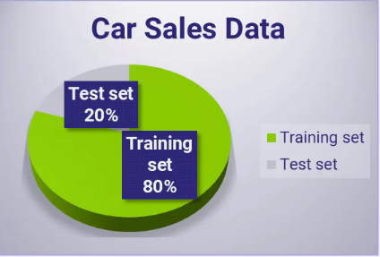

### CROSS VALIDATION
 
However, cross-validation is a method that goes beyond evaluating a single model using a single train and test split of the data. 
It is applied to more subsets created using the training dataset and each of which is used to train and evaluate a separate model. 
That is, we split our training dataset into k subsets and the ith model will be built on the union of all subsets except the ith. 
We then test for the performance of the model i on the ith part.

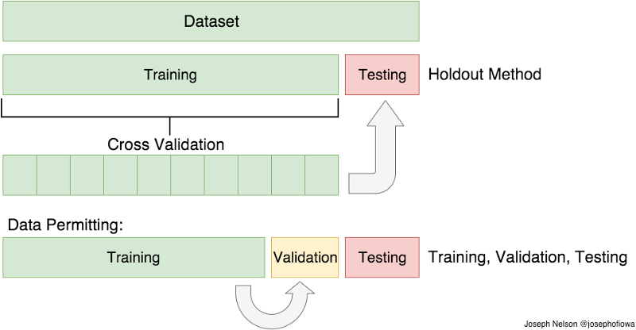

### TRAIN TEST SPLIT

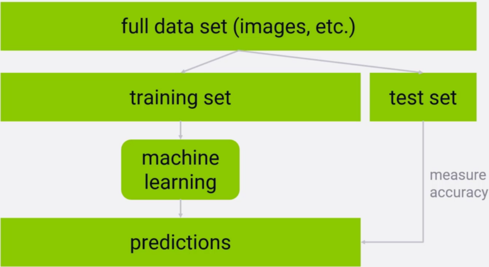

### TRAIN/TEST GOOD PRACTICE

*  **Test/Training** sets must be large enought to contain representation of all variations and outliers in the data
*  data must be selected randomly
*  Train/Test is a good way of guarding agains overtfitting

### Overfitting

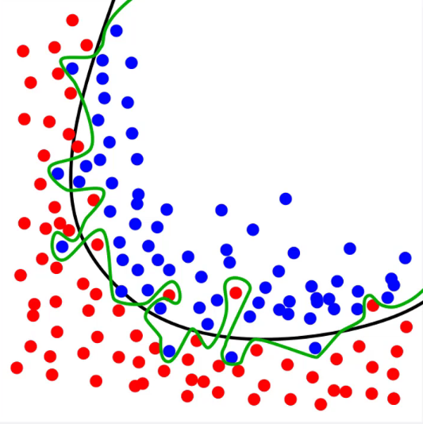


In statistics, overfitting is "the production of an analysis that corresponds too closely or exactly to a particular set of data, and may therefore fail to fit additional data or predict future observations reliably.
Is it as if you **would have an model** that would know all the answers and it will cheat. 
In practice we want a model that is general enough that is able to give good prediction to new datasets.

### TRAIN/TEST FALLIBILITY

Training/Testing datasets ca be to small and overfitting can still happen as the model can look similar under those circumstances

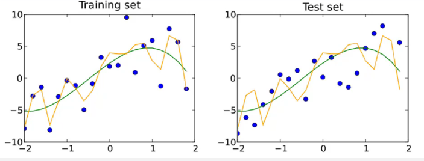

### K-Fold CROSS VALIDATION

* Split the data into k segments:
* Reserves one fold for testing
* Evaluates the rest K-1 of the sets against the testing sets
* Takes the average of the K-1 r-squared scores

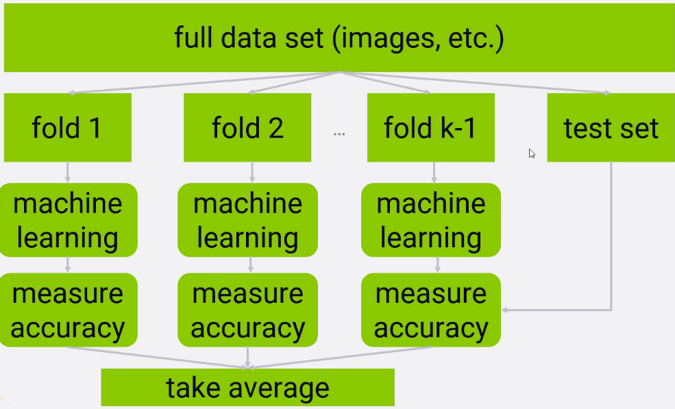

### HOLDOUT VALIDATION:

* Splitting the full dataset into 2 partitions:
        * a training set
        * a test set
* training the model on the training set, using the trained model to predict labels on the test set,
* computing an error metric to understand the model's effectiveness,
* switch the training and test sets and repeat,
* average the errors.

In the holdout validation the split is 50/50 not 75/25 this way we avoid potential source of variation in the model performance.

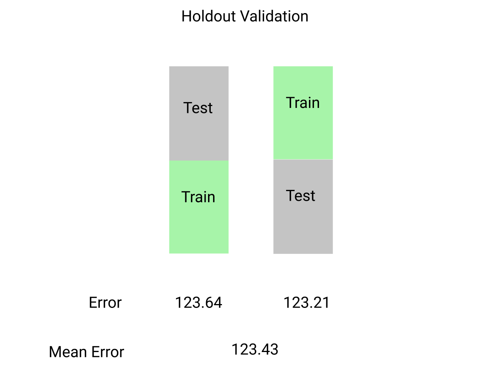

### LINEAR REGRESSION

* fit a line to a data set of observations
* use this line to predict unobserved values

Example below show a linear regression model where we might approximate an individual height based on it's weight

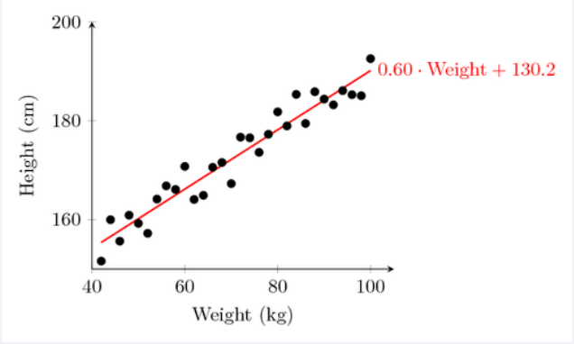

### HOW DOES LINEAR REGRESSION WORK

* usually using “ordinary least squares”
* minimizes the squared-error between each point and the line
* the slope-intercept equation of a line is y=mx+b
* the slope is the correlation between the two variables times the standard deviation in Y, all divided by the standard deviation in X.
* the intercept is the mean of Y minus the slope times the mean of X

### LINEAR REGRESSION AN INTUITIVE APPROACH

If we want to approximate the  trajectory of a line we might do this by approximating it with a tangent.
The location of each point on that line or the the change between the previous set of points (x,y) and (x1,y1) can be expressed geometrically

### SLOPE OF THE FUNCTION

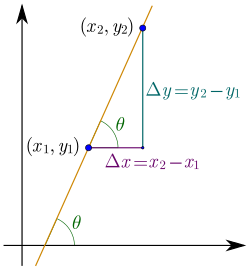

### MATHEMATICS OF THE SLOPE

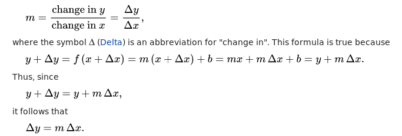


### Animated illustration: the tangent line (derivative) as the limit of secants

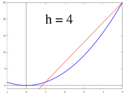

### Tangent Line 2


### UNVARIATE LINEAR REGRESSION

Consider the model function

    y = α + β x

which describes a line with slope β and y-intercept α. In general such a relationship may not hold exactly for the largely unobserved population of values of the independent and dependent variables; we call the unobserved deviations from the above equation the errors. Suppose we observe n data pairs and call them {(xi, yi), i = 1, ..., n}. We can describe the underlying relationship between yi and xi involving this error term εi by

    y i = α + β x i + ε i 
    

We can determine the model performance by calculatind the **RSS(RESIDUAL SUM Of SQUARES)** which is or the sum of squared errors of prediction is the sum of the squares of residuals (deviations predicted from actual empirical values of data). 
It is a measure of the discrepancy between the data and an estimation model. A small RSS indicates a tight fit of the model to the data. It is used as an optimality criterion in parameter selection and model selection. 

### RSS


### LOGISTIC REGRESSION

* regression for binary (yes/no) problems
* like linear regression, but final predictions are transformed into a 0-1 range
* we might think of it as a probability of the answer to be either **"yes/no"**

### LOGISTIC/SIGMOID FUNCTION

Logistic regression is just a binary classification.  So this allows us to transform our final predicted number which is between 0 and 1 into some other function.
If a point ends up above 0.5 we can predict a 1.
If it's below 0.5 we can predict it's a zero

What is going on here it's translating the  output of logistic regression itself into a probability of it either being **1 or 0 yes or no**.

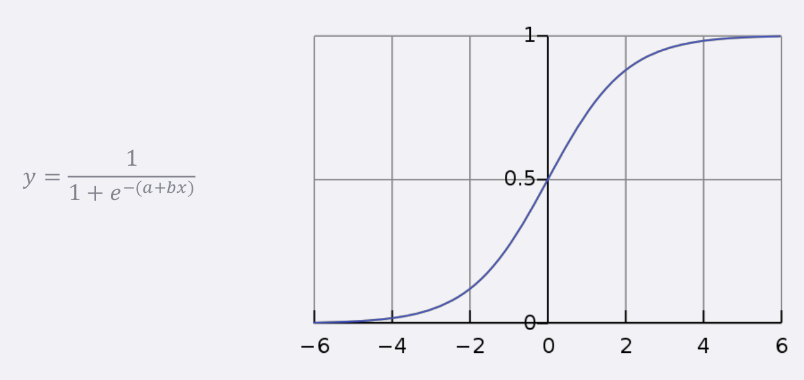

### LOSS FUNCTION FOR LOGISTIC REGRESSION

* least-squares won’t work with the logistic curve
* instead we use gradient descent with maximum likelihood
* this just iterates to maximize the conditional probability of Y given X

### DECISION TREES

* you can  construct a flowchart to help you decide a classification for something with machine learning
* this is called a decision tree
* another form of supervised learning
* Give it some sample data and the resulting classifications gives a decision tree

### DECISION TREES EXAMPLE

* you want to build a system to filter out resumes based on historical hiring data
* you have a database of some important attributes of job candidates, and you know which ones were hired and which ones weren’t
* you can train a decision tree on this data, and arrive at a system for predicting whether a candidate will get hired based on it!

 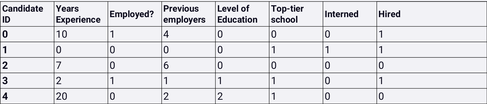

### FLOW CHART EXAMPLE

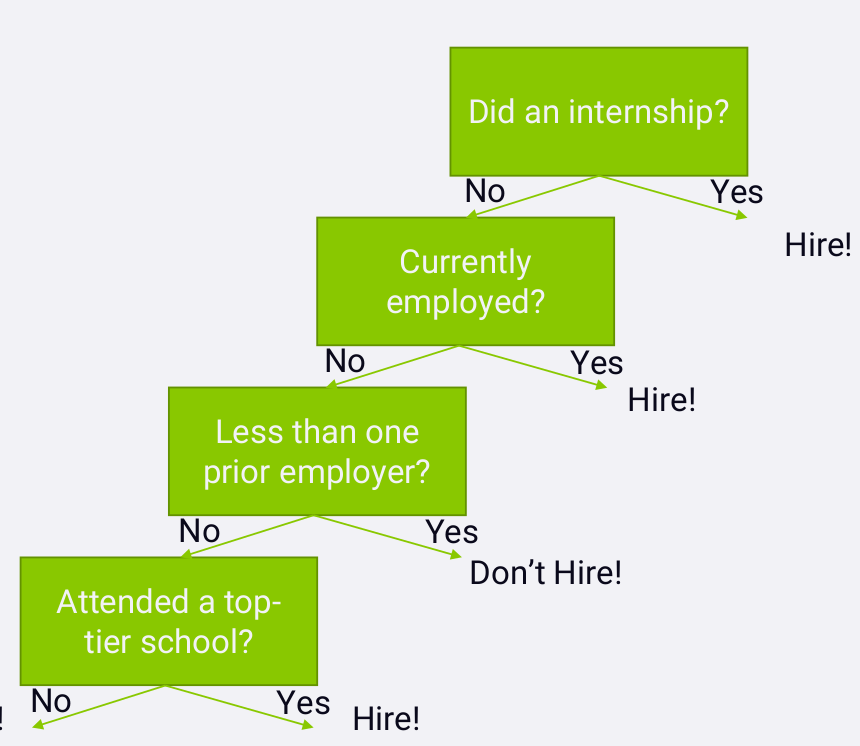

### HOW DECISION TREES WORK

* at each step, find the attribute we can use to partition the data set to minimize the entropy of the data at the next step
* The scientific term for the algorithm: ID3
* it is a greedy algorithm – as it goes down the tree, it just picks the decision that reduce entropy the most at that stage.
* that might not actually result in an optimal tree, but it works.

### RANDOM FOREST(OR RANDOM DECISION TREES) 

* decision trees are very susceptible to overfitting
* to fight this, we can construct several alternate decision trees and let them “vote” on the final classification
* randomly re-sample the input data for each tree (fancy term for this: bootstrap aggregating or bagging)
* randomize a subset of the attributes each step is allowed to choose from


To visualize the decision trees in a flow chart fashin we need to install `pydotplus` package:

```conda install pydotplus```


Resources:

 * https://www.quora.com/What-is-cross-validation-in-machine-learning
 * https://en.wikipedia.org/wiki/Overfitting
 * https://en.wikipedia.org/wiki/Residual_sum_of_squares
 
