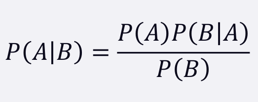
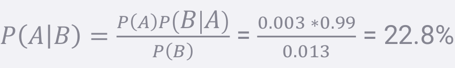

### Bayes’ Theorem

* The probability of A given B, is the probability of A times the probability of B given A over the probability of B.
* the key insight is that the probability of something that depends on B depends very much on the base probability of B and A.

### The Math Formula

 

### Using Bayes Theorem to predict drug use:

* drug testing is a common example. even a “highly accurate” drug test can produce more false positives than true positives.
* let’s say we have a drug test that can accurately identify users of a drug 99% of the time, and accurately has a negative result for 99% of non-
users. but only 0.3% of the overall population actually uses this drug.
* event A = is a user of the drug, event B = tested positively for the drug.
* we can work out from that information that P(B) is 1.3% (0.99 *0.003 + 0.01 * 0.997 – the probability of testing positive if you do use, plus the probability of testing positive if you don’t.)

* so the odds of someone being an actual user of the drug given that they tested positive is only 22.8%!
* even though P(B|A) is high (99%), it doesn’t mean P(A|B) is high

